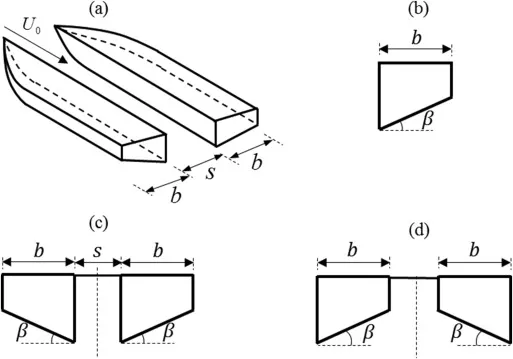

# Chun's Notes

## Installing Arduino on VSCode
- Arduino install not needed
- Install extension
- Ctrl+Shift+P -> Arduino: Board Manager
- Install Arduino MegaAVR boards
- Select .ino file
- Select bundled Arduino install bottom right
- Bottom right select board
- Set baud rate
- Bottom right select COM port
- 

[nRF24L01 pins explained](https://www.elprocus.com/nrf24l01/)

Pin 1 (GROUND/Vss): It is a common ground connection for the system.

Pin 2 (VCC): It refers to the power supply pin of 3.3 Volts given to the module. The NRF24L01 module contains two power supply pins for operation.

Pin 3 (CE): Chip Enable: It is an input pin that enables the control of data transmission and reception in transmitter and receiver modes. It activates the SPI communication.

Pin 4 (CSN): Chip Select Not: It is an active-high pin, which can send the device an SPI command or can get the data from the chip on the SPI bus. It provides communication between the module and the microcontroller. When it is active low, then the SPI is disabled and the NRF24L01 starts listening to data on the SPI port for processing.

Pin 5 (SCK): Serial Clock: It refers to the clock pulse of the NRF24L01 to enable the SPI communication. It transmits the data between the microcontroller and the module according to the clock pulse.

Pin 6 (MOSI): Master Out Slave In The transmitted data via SPI by the microcontroller is received by the NRF24L01 module. Here the microcontroller acts as a master and the NRF24L01 acts as a slave. This pin refers to the MOSI pin connection on the microcontroller SPI interface. Note that the NRF24L01 module never sends the data without the first request of data by the microcontroller.

Pin 7 (MISO): Master In Slave Out: It is connected to the MISO pin of the microcontroller. Data transmitted from the NRF24L01 module via the SPI bus is received by the microcontroller. Here the NRF24L01 module acts as a master and the microcontroller acts as the slave.

Pin 8 (IRQ): Interrupt Pin: It is an active low pin. This module contains 3 interrupt pins and generates an interrupt whenever the new data is available on the SPI bus. It is also used for sending feedback to the sender.

[How to wire nRF224L01 with Arduino](https://howtomechatronics.com/tutorials/arduino/arduino-wireless-communication-nrf24l01-tutorial/)

## 3D Printing

Max Print Size: 
220x220x250mm

Nozzle size: 0.4mm
Extra space required: 60% * nozzle size: = 0.24mm

gekartelde moer
ball bearings + M5 schroef

## Bearings
[Youtube video about bearings in 3D prints](https://www.youtube.com/watch?v=8V8MH2k8Igs)

## CAR SHAPES

[Race Car Aerodynamics](https://airshaper.com/videos/race-car-aerodynamics/GApwSjKYUpQ)

[Airshaper Race Car Aerodynamics video](https://www.youtube.com/watch?v=GApwSjKYUpQ)

Some F1 car shapes
[F1 car](https://us.motorsport.com/f1/news/f1-vs-f2-top-speed-car-sizes-race-weekends-and-more-compared/10500370/)

## Turning
(About Steering video)[https://www.youtube.com/watch?v=ltufRS3xj30]
Castor Angle,
Camber,
King Pin Inclination

## BOAT SHAPES
### About aspect ratios in boats.
[Boat Beam](https://en.wikipedia.org/wiki/Beam_(nautical))
> The beam of a ship is its width at its widest point. The maximum beam (BMAX) is the distance between planes passing through the outer sides of the ship, beam of the hull (BH) only includes permanently fixed parts of the hull, and beam at waterline (BWL) is the maximum width where the hull intersects the surface of the water.[1]

[Basics of Boat Design](https://www.compositesworld.com/articles/the-basics-of-boat-design)

>  Since a typical ratio of beam to length is about 33 percent, this defines the boat's overall length. "The 33 percent number is not a hard number -- it varies depending on the requirements of the owner," Swanhart explains. "For smaller boats -- less than 13.7m/45 ft in length -- the beam ratio has increased slightly in recent years to allow slightly larger cabin accommodations."

>Weight location also is key, because it affects the longitudinal center of gravity and hull performance, says Swanhart.

>The final hull shape was developed with a surfacing software package called MultiSurf by AeroHydro Inc. (Southwest Harbor, Maine, U.S.A.). Rhino software from Robert McNeel & Assoc. (Seattle, Wash., U.S.A.) was used to develop the more intricately shaped deck parts.

### WTF are Chines
[Chine (boating)](https://en.wikipedia.org/wiki/Chine_(boating)#:~:text=A%20chine%20in%20boat%20design,as%20the%20mode%20of%20construction.)
>A chine in boat design is a sharp change in angle in the cross section of a hull. The chine typically arises from the use of sheet materials (such as sheet metal or marine ply) as the mode of construction.

S-bottom hull (A), compared to a hard (B) and soft (C) chine hull

> "The chine joint tends to want to act as a hinge, as the bottom of the boat flexes inward and the sides flex inward due to the external pressures," says Rob Schofield (Robert A. Schofield, Naval Architect, Melbourne, Fla., U.S.A.). 

### Hull shapes
[Boat Hull Types](https://uk.boats.com/boat-buyers-guide/boat-hull-types/#:~:text=Types%20of%20boat%20hulls&text=Deep%2DV%20hulls%3A%20a%20wedge,universal%20on%20modern%20planing%20boats.)

>Unless you're buying a simple rowboat, few boats are actually flat-bottomed. However, this term also refers to a hull that has almost no deadrise, or just a few degrees at most. Flat-bottomed designs are popular for high-performance boats that skim across the smooth waters of lakes and rivers to achieve maximum speed. 

>Deep-V hulls [...] provides smooth sailing through rough waters as the hull cuts cleanly through waves. For this reason, it’s popular for offshore sportfishing boats. The ‘downsides’ to this hull design include a reduced suitability for shallow water use and less stability (deep-V hulls tend to roll in choppy conditions when at low speed or at rest). Additionally, the deep-V has more drag than a flat-bottom hull, requiring more power to reach the same speed.    

>CATAMARANS Using two hulls bridged by a deck (imagine two logs tied together), the catamaran design provides additional beam, increased stability and increased speed (the slim twin hulls have little drag). Catamarans also generally have a shallower draft and require smaller engines than similarly sized monohulls. The main drawback to a catamaran is that it has less usable inside volume than a monohull. This means the cabin and cockpit layout are often compromised.

###  On multihull boat stability

[Choosing the right beam for a multihull](https://smalltridesign.com/Trimaran-Articles/design/length-beam-ratio.html)

### On catamaran Hull Design
[Catamarn Hull Design](https://www.catamaransite.com/reference/catamaran_hull_dimensioning/)

>If the boat is designed too light, she will not take any kind of punishment. Too slim a hull design and the boat becomes a large Hobie Cat capable of only carrying your lunch.
>We all know that multihulls can be made faster by making them longer or lighter or by adding more sail.
>But since most multihulls have similar Depth/WL beam ratios you can pretty much say the SLR equates to the LWL/BWL ratio. Typically this will be 8-10:1 for a slow cruising catamaran (or the main hull of most trimarans), 12-14:1 for a performance cruiser and 20:1 for an extreme racer.

>So by and large faster boats have finer hulls. But the wetted surface area (WSA) increases proportionately as fineness increases (for a given displacement the half orange shape gives the least WSA) so fine hulls tend to be slower in low wind speeds.

>The most important catamaran design hull shape factor, is the Prismatic Coefficient (Cp). This is a measure of the fullness of the ends of the hull. Instinctively you might think that fine ends would be faster as they would “cut through the water better”. But in fact you want a high Cp for high speeds. However everything is interrelated. If you have fine hulls you can use a lower Cp. Most monohulls have a Cp of 0.55- 0.57. And that is about right for displacement speeds.

>However the key to Catamaran design is you need a higher Cp if you want to sail fast. So a multihull should be at least 0.61 and a heavy displacement multihull a bit higher still. It is difficult to get much over 0.67 without a very distorted hull shape or one with excessive WSA. So all multihulls should have a Cp between 0.61 and 0.65. None of this is very special or new. It has been well known by naval architects for at least 50 years.

>There are various ways of achieving a high Cp. You could fit bulb bows (as Lock Crowther did). 

>Another way is to have a very wide planing aft section. But that can increase WSA and leads to other problems I’ll mention in a minute. Finally you can flatten out the hull rocker (the keel shape seen from the side) and add a bustle aft. That is the approach I use, in part because that adds displacement aft, just where it is most needed.

What is Bulb Bows

What is LWL, WL, BWL, and Cp, WSA, Hull Rocker, Planing Aft, Bustle Aft

